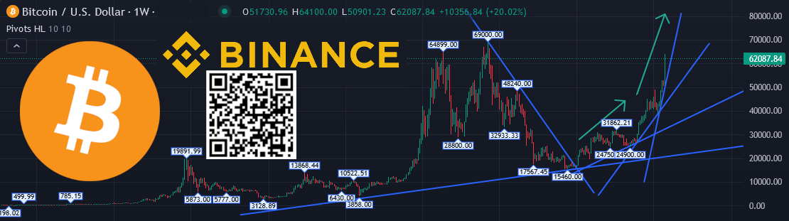
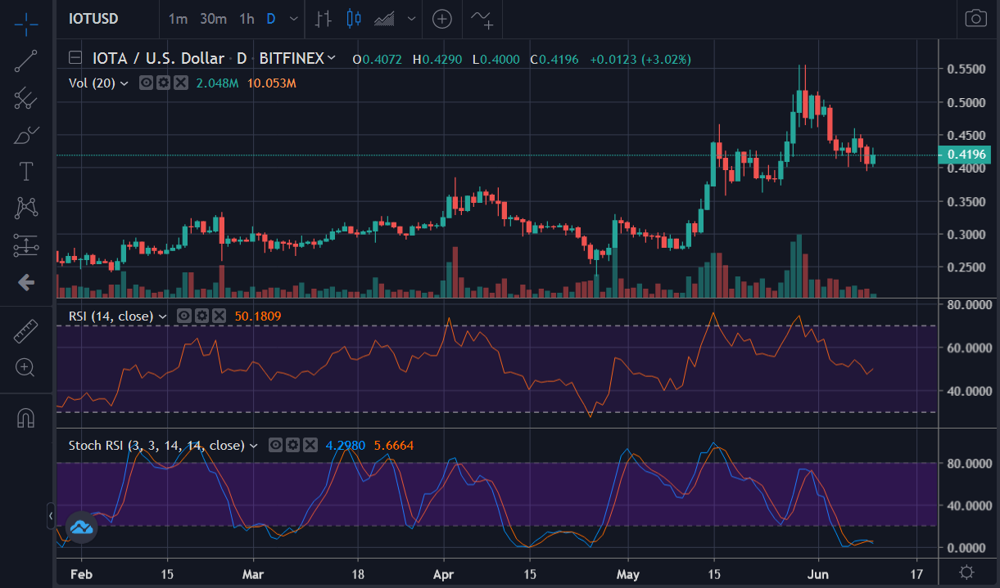
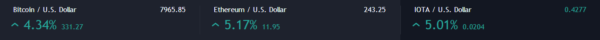
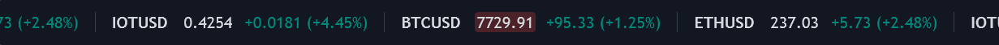
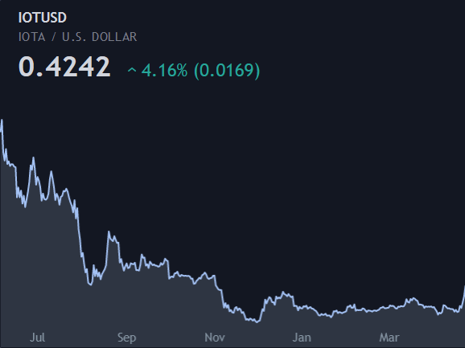
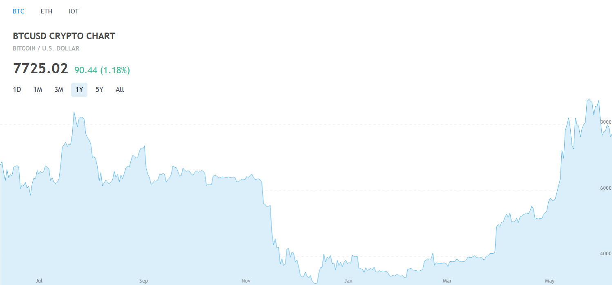
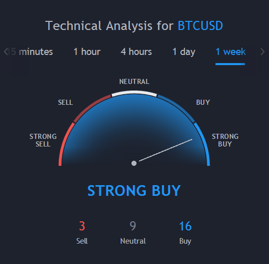
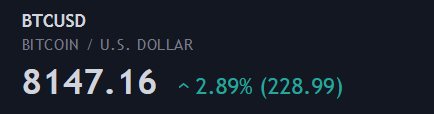
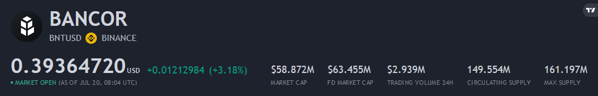

# 💹 HTML Crypto Currency Chart Snippets 💹
💹 Simple HTML Snippets to create Tickers / Charts of Cryptocurrencies with the TradingView API 💹



## [💹 Candlestick Chart with Indicators 💹](https://idouble.github.io/HTML-Crypto-Currency-Chart-Snippets/Chart)



```
<div class="tradingview-widget-container">
  <div id="tradingview_74048"></div>
  <div class="tradingview-widget-copyright"><a href="https://www.tradingview.com/symbols/BITFINEX-IOTUSD/" rel="noopener" target="_blank"><span class="blue-text">IOTUSD Chart</span></a> by TradingView</div>
  <script type="text/javascript" src="https://s3.tradingview.com/tv.js"></script>
  <script type="text/javascript">
  new TradingView.widget(
  {
  "autosize": true,
  "symbol": "BINANCE:IOTAUSD",
  "interval": "D",
  "timezone": "Europe/Zurich",
  "theme": "Dark",
  "style": "1",
  "locale": "en",
  "toolbar_bg": "#f1f3f6",
  "enable_publishing": false,
  "hide_side_toolbar": false,
  "allow_symbol_change": true,
  "studies": [
    "RSI@tv-basicstudies",
    "StochasticRSI@tv-basicstudies"
  ],
  "container_id": "tradingview_74048"
}
  );
  </script>
</div>
```

## [💲 Crypto Currency Ticker 💲](https://idouble.github.io/HTML-Crypto-Currency-Chart-Snippets/Ticker)



```
<div class="tradingview-widget-container">
  <div class="tradingview-widget-container__widget"></div>
  <div class="tradingview-widget-copyright"><a href="https://www.tradingview.com" rel="noopener" target="_blank"><span class="blue-text">Quotes</span></a> by TradingView</div>
  <script type="text/javascript" src="https://s3.tradingview.com/external-embedding/embed-widget-tickers.js" async>
  {
  "symbols": [
    {
      "description": "",
      "proName": "COINBASE:BTCUSD"
    },
    {
      "description": "",
      "proName": "COINBASE:ETHUSD"
    },
    {
      "description": "",
      "proName": "BINANCE:IOTAUSD"
    }
  ],
  "colorTheme": "dark",
  "isTransparent": false,
  "locale": "en"
}
  </script>
</div>
```

## [💲 Crypto Currency Ticker Tape 💲](https://idouble.github.io/HTML-Crypto-Currency-Chart-Snippets/Ticker-Tape)



```
<div class="tradingview-widget-container">
  <div class="tradingview-widget-container__widget"></div>
  <div class="tradingview-widget-copyright"><a href="https://www.tradingview.com" rel="noopener" target="_blank"><span class="blue-text">Ticker Tape</span></a> by TradingView</div>
  <script type="text/javascript" src="https://s3.tradingview.com/external-embedding/embed-widget-ticker-tape.js" async>
  {
  "symbols": [
    {
      "description": "",
      "proName": "COINBASE:BTCUSD"
    },
    {
      "description": "",
      "proName": "COINBASE:ETHUSD"
    },
    {
      "description": "",
      "proName": "BINANCE:IOTAUSD"
    }
  ],
  "colorTheme": "dark",
  "isTransparent": false,
  "displayMode": "adaptive",
  "locale": "en"
}
  </script>
</div>
```

## [💹 Mini Chart 💹](https://idouble.github.io/HTML-Crypto-Currency-Chart-Snippets/Mini-Chart)



```
<div class="tradingview-widget-container">
  <div class="tradingview-widget-container__widget"></div>
  <div class="tradingview-widget-copyright"><a href="https://www.tradingview.com/symbols/BITFINEX-IOTUSD/" rel="noopener" target="_blank"><span class="blue-text">IOTUSD Rates</span></a> by TradingView</div>
  <script type="text/javascript" src="https://s3.tradingview.com/external-embedding/embed-widget-mini-symbol-overview.js" async>
  {
  "symbol": "BINANCE:IDEXUSD",
  "width": "100%",
  "height": "100%",
  "locale": "en",
  "dateRange": "12m",
  "colorTheme": "dark",
  "trendLineColor": "rgba(164, 194, 244, 1)",
  "underLineColor": "rgba(201, 218, 248, 0.15)",
  "isTransparent": false,
  "autosize": true,
  "largeChartUrl": ""
}
  </script>
</div>
```

## [💹 Overview Chart 💹](https://idouble.github.io/HTML-Crypto-Currency-Chart-Snippets/Overview-Chart)



```
<div class="tradingview-widget-container">
  <div id="tv-medium-widget"></div>
  <div class="tradingview-widget-copyright"><a href="https://www.tradingview.com/symbols/COINBASE-BTCUSD/" rel="noopener" target="_blank"><span class="blue-text">BTC</span></a>, <a href="https://www.tradingview.com/symbols/COINBASE-ETHUSD/" rel="noopener" target="_blank"><span class="blue-text">ETH</span></a> <span class="blue-text">and</span> <a href="https://www.tradingview.com/symbols/BITFINEX-IOTUSD/" rel="noopener" target="_blank"><span class="blue-text">IOT Quotes</span></a> by TradingView</div>
  <script type="text/javascript" src="https://s3.tradingview.com/tv.js"></script>
  <script type="text/javascript">
  new TradingView.MediumWidget(
  {
  "container_id": "tv-medium-widget",
  "symbols": [
    [
      "BTC",
      "COINBASE:BTCUSD|12m"
    ],
    [
      "ETH",
      "COINBASE:ETHUSD|12m"
    ],
    [
      "IOT",
      "BINANCE:IOTAUSD|12m"
    ]
  ],
  "greyText": "Quotes by",
  "gridLineColor": "#e9e9ea",
  "fontColor": "#83888D",
  "underLineColor": "#dbeffb",
  "trendLineColor": "#4bafe9",
  "width": "100%",
  "height": "100%",
  "locale": "en"
}
  );
  </script>
</div>
```

## [💹 Technical Analysis 💹](https://idouble.github.io/HTML-Crypto-Currency-Chart-Snippets/Technical-Analysis)



```
<div class="tradingview-widget-container">
  <div class="tradingview-widget-container__widget"></div>
  <div class="tradingview-widget-copyright"><a href="https://www.tradingview.com/symbols/COINBASE-BTCUSD/technicals/" rel="noopener" target="_blank"><span class="blue-text">Technical Analysis for BTCUSD</span></a> by TradingView</div>
  <script type="text/javascript" src="https://s3.tradingview.com/external-embedding/embed-widget-technical-analysis.js" async>
  {
  "showIntervalTabs": true,
  "width": "100%",
  "colorTheme": "dark",
  "isTransparent": false,
  "locale": "en",
  "symbol": "COINBASE:BTCUSD",
  "interval": "1W",
  "height": "100%"
}
  </script>
</div>
```

## [💲 Single Ticker 💲](https://idouble.github.io/HTML-Crypto-Currency-Chart-Snippets/Single-Ticker)



```
<div class="tradingview-widget-container">
  <div class="tradingview-widget-container__widget"></div>
  <div class="tradingview-widget-copyright"><a href="https://www.tradingview.com/symbols/COINBASE-BTCUSD/" rel="noopener" target="_blank"><span class="blue-text">BTCUSD Rates</span></a> by TradingView</div>
  <script type="text/javascript" src="https://s3.tradingview.com/external-embedding/embed-widget-single-quote.js" async>
  {
  "symbol": "COINBASE:BTCUSD",
  "width": "100%",
  "colorTheme": "dark",
  "isTransparent": false,
  "locale": "en"
}
  </script>
</div>
```

## [💲 Symbol Info 💲](https://idouble.github.io/HTML-Crypto-Currency-Chart-Snippets/Symbol-Info)



```
<div class="tradingview-widget-container">
  <div class="tradingview-widget-container__widget"></div>
  <div class="tradingview-widget-copyright"><a href="https://www.tradingview.com/" rel="noopener nofollow" target="_blank"><span class="blue-text">Track all markets on TradingView</span></a></div>
  <script type="text/javascript" src="https://s3.tradingview.com/external-embedding/embed-widget-symbol-info.js" async>
  {
  "symbol": "BINANCE:IDEXUSD",
  "width": "100%",
  "locale": "en",
  "colorTheme": "dark",
  "isTransparent": false
}
  </script>
</div>
```


